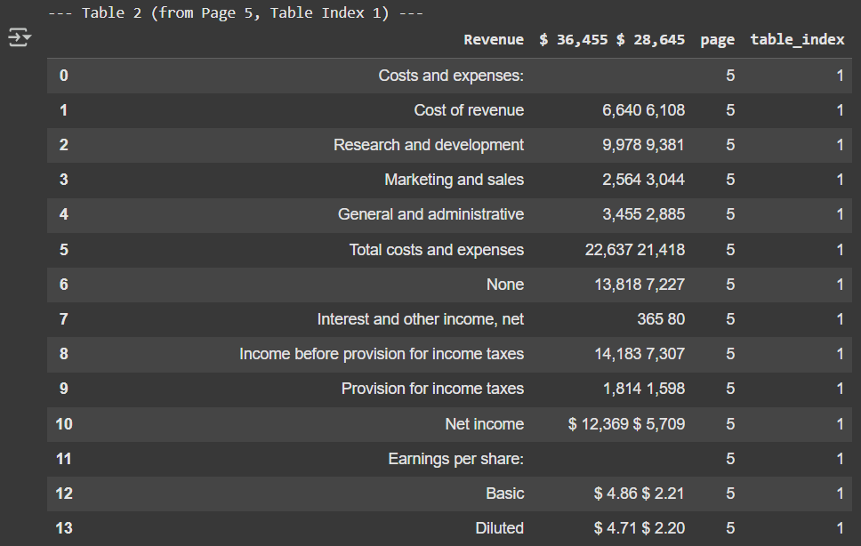

# 📊 Step 2: Structured Data Integration in RAG Pipeline

In this step, the RAG system is enhanced by integrating **structured data** from tables within the financial PDF alongside unstructured text. This hybrid approach enables more accurate and complete answers, especially for queries requiring tabular figures.

---

## 📌 Objectives

- Parse and integrate structured data (tables) into the QA pipeline.
- Combine vector search on text with keyword search on tabular data.
- Construct a hybrid prompt with both sources for Gemini LLM.

---

## ⚙️ Tools & Libraries Used

- `pdfplumber` – Table extraction from PDF
- `langchain` – Text chunking and vector storage
- `sentence-transformers` – Text embeddings (`all-MiniLM-L6-v2`)
- `FAISS` – Fast similarity search on chunks
- `google-generativeai` – Gemini 2.5 Pro LLM for answering queries
- `PyMuPDF` & `PyPDF` – Document loading and parsing

---

## 🧩 Pipeline Process

### Step 1: Load & Chunk Unstructured Text

- Load PDF using `PyPDFLoader`.
- Split into chunks using `RecursiveCharacterTextSplitter`.
- Embed with HuggingFace’s `all-MiniLM-L6-v2` and store in FAISS.

```python
documents = loader.load()
chunks = splitter.split_documents(documents)
```

---

### Step 2: Extract Structured Data (Tables)

- Extract all tables using `pdfplumber`.
- Each table is converted into a Pandas `DataFrame` with associated `page` and `table_index` metadata.

```python
df['page'] = i + 1
df['table_index'] = table_index + 1
```

---

### Step 3: Hybrid Retrieval

The `retrieve_context_and_data()` function performs:

1. **Vector search** from FAISS to get top-k relevant text chunks.
2. **Keyword search** inside structured tables using `.contains(query)` for partial matches.

---

### Step 4: Answer Generation (Gemini Pro)

- Both retrieved text and table rows are added to the prompt.
- Gemini is asked to answer using both context types.

```text
Text Context:
{text_context}

Structured Data:
{structured_data}

Query:
{user_query}
```
### Tables extracted:

---

## 💬 Sample Queries

```python
generate_answer("What was Meta’s net income in Q1 2024 compared to Q1 2023?")
generate_answer("Summarize Meta’s operating expenses in Q1 2024.")
```

---

## ✅ Output Sample

- 3 most relevant text chunks (via FAISS)
- Matching rows from any financial tables
- Combined answer from Gemini Pro

## Answers
```
🟨 Query: What was Meta’s net income in Q1 2024 compared to Q1 2023?

🟩 Answer:
 Based on the provided context, Meta's net income for the first quarter of 2024 was **$12,369 million**, compared to **$5,709 million** in the first quarter of 2023. This was an increase of 117%.

🟨 Query: Summarize Meta’s operating expenses in Q1 2024.

🟩 Answer:
 Based on the provided context, Meta's total costs and expenses for the first quarter of 2024 were **$22,637 million**.

The breakdown is as follows:
*   **Research and development:** $9,978 million
*   **Cost of revenue:** $6,640 million
*   **General and administrative:** $3,455 million
*   **Marketing and sales:** $2,564 million
```

---

## 🧠 Benefits of This Step

| Feature                  | Step 1       | Step 2 (Improved)         |
|--------------------------|--------------|----------------------------|
| Table Understanding      | ❌ None       | ✅ Yes (via Pandas)         |
| Hybrid Retrieval         | ❌ Text only  | ✅ Text + Tables            |
| Prompt Context           | 🔸 Limited    | ✅ Rich (unstructured + structured) |
| Query Accuracy           | ⚠️ Moderate   | ✅ High                     |

---

<!-- ## 📁 Folder Structure

```
step2_structured_data/
├── README.md
├── rag_step2_hybrid.ipynb
├── extracted_tables.json
├── sample_outputs/
``` -->


## 📎 References

- [LangChain](https://docs.langchain.com/)
- [Sentence Transformers](https://www.sbert.net/)
- [FAISS](https://github.com/facebookresearch/faiss)
- [Gemini API](https://ai.google.dev/)
- [pdfplumber](https://github.com/jsvine/pdfplumber)

---

## 🚀 Status

✅ Completed. Successfully integrates structured data with unstructured text for enhanced financial QA.
