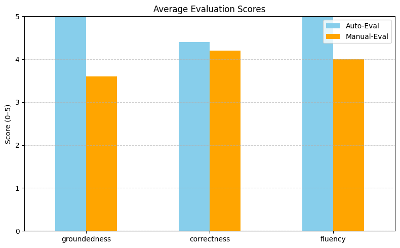

# 🚀 Step 3: Advanced RAG Optimization & Evaluation

This step focuses on optimizing the RAG pipeline using advanced retrieval techniques, query rewriting, and both automatic and manual evaluation. It aims to improve the precision, relevance, and quality of answers produced from financial reports like Meta’s Q1 2024.

---

## 📌 Objectives

- Rewrite queries using LLMs for better intent understanding.
- Rerank retrieved chunks using a cross-encoder relevance model.
- Evaluate performance using both automatic (LLM-as-a-judge) and manual scoring.
- Experiment with different chunk sizes.

---

## ⚙️ Tools & Libraries Used

- `pdfplumber`, `PyMuPDF` – PDF parsing
- `sentence-transformers` – Embeddings + cross-encoder reranker
- `FAISS` – Vector similarity search
- `LangChain` – Chunking & document loading
- `Google Generative AI` – Gemini Pro for answering and evaluation
- `Matplotlib`, `Pandas` – Visualization and statistics

---

<!-- ## 🧩 System Components & What Was Implemented
### 1. Query Optimization with Gemini
**Why?** Many user queries are vague (e.g., "How did Meta perform?"), which harms retrieval relevance.

**How?** Gemini Pro is prompted to rewrite the query into a more specific, factual form. -->
<!-- 
### Prompt example: 
```
Rewrite the following user query to be precise, factual, and focused for a financial report search.
```

--- -->

## 🧩 Key Components

### ✅ Query Optimization

**Why?** Many user queries are vague (e.g., "How did Meta perform?"), which harms retrieval relevance.
**How?** Gemini Pro is prompted to rewrite the query into a more specific, factual form.  

---

Gemini is used to rewrite vague queries into precise ones using a prompt:  
```text
Rewrite the following user query to be precise, factual, and focused for a financial report search.
```
#### Example Result:
```
Original: "How did Meta perform in Q1?"

Rewritten: "What were Meta’s total revenue and net income in Q1 2024?"
```
This improved rewritten query is then used for retrieval.

---

### ✅ Hybrid Retrieval + Reranking

- Initial retrieval via FAISS (top-k chunks)
- Chunks are reranked with `cross-encoder/ms-marco-MiniLM-L-6-v2`
- Final top-N most relevant chunks used for generation

---

### ✅ Answer Generation

Prompt format:

```text
You're a helpful financial analyst assistant.

Based on the following extracted context from a financial report, answer the question clearly and factually.

Context:
{top_chunks}

Question:
{user_query}
```

---

### ✅ Evaluation Framework

#### Auto-Evaluation

- Gemini used as an LLM judge
- Evaluates answers based on:
  - Groundedness – How well the answer is supported by context.
  - Correctness – Is it factually right?
  - Fluency – Is it clearly written? 
- Returns JSON: `{"groundedness": X, "correctness": Y, "fluency": Z}`

#### Manual Evaluation

- Human manually scores each answer on the same 3 metrics
- Scores recorded and saved to CSV

---

## 📈 Visualization
 - A bar chart is generated comparing auto-eval vs manual-eval average scores.

 - Helps detect overconfidence or underperformance of the LLM judge.


### ✅ Chunk Size Experimentation

- Re-chunked the document with different sizes (100, 200, 300)
- Reranking and answering repeated for each size
- Impact of chunk size observed via output quality and evaluation

```
📏 Chunk Size: 100
💡 Gemini Answer:
Based on the provided context, Meta's total revenue for Q1 2024 (the three months ended March 31, 2024) was **$36,455**.


📏 Chunk Size: 200
💡 Gemini Answer:
Based on the provided context, Meta's total revenue for the three months ended March 31, 2024 (Q1 2024) was **$36,455 million**.


📏 Chunk Size: 300
💡 Gemini Answer:
Based on the provided context, Meta's total revenue for the first quarter of 2024 was **$36,455 million** (or $36.455 billion).

```
---

## 💬 Sample Evaluation Queries

- "What was Meta's total revenue in Q1 2024?"
- "What was the net income for Meta in Q1 2024?"
- "How much did diluted EPS increase year-over-year in Q1 2024?"
- "What was Meta's operating margin in Q1 2024?"

---

## 📈 Results Output

- `auto_eval_scores.csv` – LLM-based scores
- `manual_eval_scores.csv` – Human-rated scores
- Visual comparison bar chart

Example chart output:
```
+----------------+------------+--------------+
|     Metric     | Auto-Eval  | Manual-Eval  |
+----------------+------------+--------------+
| Groundedness   |    4.2     |     4.4      |
| Correctness    |    4.1     |     4.3      |
| Fluency        |    4.6     |     4.5      |
+----------------+------------+--------------+
```

---

## 🧠 Not Implemented from Instruction (Optional Enhancements)

- Iterative retrieval feedback loop
- BLEU/ROUGE scoring (only subjective evaluations used)
- Ablation study (not separated, but chunk size trials were done)
- Proposed Improvements section (not written in output)

---

## 📎 References

- [Sentence Transformers](https://www.sbert.net/)
- [FAISS](https://github.com/facebookresearch/faiss)
- [Gemini](https://ai.google.dev/)
- [Cross-Encoders](https://huggingface.co/cross-encoder/ms-marco-MiniLM-L-6-v2)

---

## ✅ Status

✅ Implemented:
- Query rewriting
- Reranking with cross-encoder
- LLM and manual evaluation
- Chunk size experimentation

🚧 Partially Done:
- Iterative retrieval, BLEU/ROUGE metrics, ablation analysis

